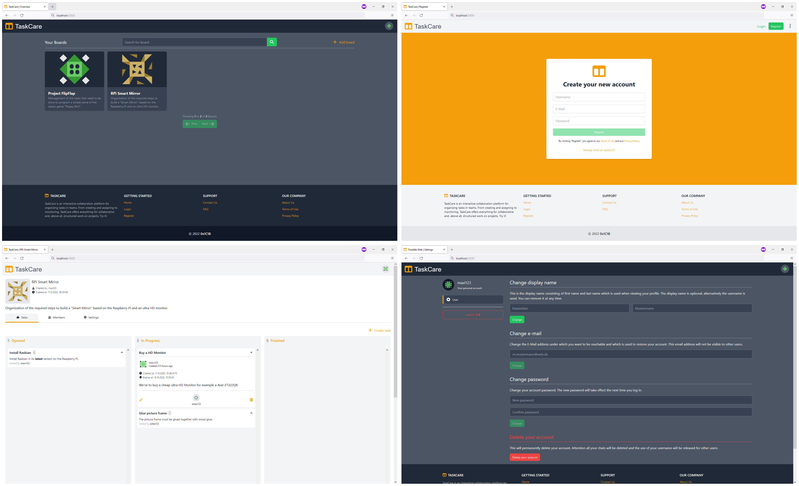

# TaskCare Web

> Collaboration platform for managing tasks in a team.

## Table of contents

- [Introduction](#introduction)
- [Deployment](#deployment)
- [License](#license)
  - [Forbidden](#forbidden)

## Introduction

This is the browser based frontend of the _TaskCare_ platform, a collaboration
network for managing tasks in teams. This web application provides a user-friendly
interface for interacting with the TaskCare platform and for managing and using
its boards.



## Deployment

Before the application can be deployed, it must be built. Since it is architecturally
a single page application, this essentially involves bundling assets and JavaScript code.

Configurations such as the URL of the [TaskCare backend](https://github.com/0x1C1B/taskcare-service)
must already be made during construction. These options can be configured via so-called
environment files. The documentation for the
[CRA](https://create-react-app.dev/docs/adding-custom-environment-variables) build tool
used can provide details on this. The options to configure are the following:

| Variable                    | Description                                                  | Required |
| --------------------------- | ------------------------------------------------------------ | -------- |
| REACT_APP_TASKCARE_REST_URI | Base URL of the TaskCare RESTful interface.                  | true     |
| REACT_APP_TASKCARE_WS_URI   | Base URL of the WebSocket endpoint of the task care backend. | true     |

The application can be built by running the following command:

```sh
$ npm run build
```

The resulting JavaScript/asset bundle can be found in the `dist` directory. An HTTP web server is
sufficient to set the application productive.

## License

Copyright (c) 2022 0x1C1B

Permission is hereby granted, free of charge, to any person obtaining a copy
of this software and associated documentation files (the "Software"), to deal
in the Software without restriction, including without limitation the rights
to use, copy, modify, merge, publish, distribute, sublicense, and/or sell
copies of the Software, and to permit persons to whom the Software is
furnished to do so, subject to the following conditions:

The above copyright notice and this permission notice shall be included in all
copies or substantial portions of the Software.

THE SOFTWARE IS PROVIDED "AS IS", WITHOUT WARRANTY OF ANY KIND, EXPRESS OR
IMPLIED, INCLUDING BUT NOT LIMITED TO THE WARRANTIES OF MERCHANTABILITY,
FITNESS FOR A PARTICULAR PURPOSE AND NONINFRINGEMENT. IN NO EVENT SHALL THE
AUTHORS OR COPYRIGHT HOLDERS BE LIABLE FOR ANY CLAIM, DAMAGES OR OTHER
LIABILITY, WHETHER IN AN ACTION OF CONTRACT, TORT OR OTHERWISE, ARISING FROM,
OUT OF OR IN CONNECTION WITH THE SOFTWARE OR THE USE OR OTHER DEALINGS IN THE
SOFTWARE.

[MIT License](https://opensource.org/licenses/MIT) or [LICENSE](LICENSE) for
more details.

### Forbidden

**Hold Liable**: Software is provided without warranty and the software
author/license owner cannot be held liable for damages.
